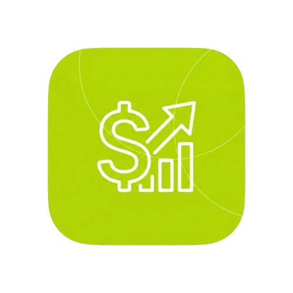

# 💰 Penny - Personal Finance Tracker

<p align="center">
  
</p>

<p align="center">
  <strong>A modern, intuitive personal finance management app built with Flutter</strong>
</p>

<p align="center">
  <a href="#features">Features</a> •
  <a href="#screenshots">Screenshots</a> •
  <a href="#installation">Installation</a> •
  <a href="#tech-stack">Tech Stack</a> •
  <a href="#architecture">Architecture</a>
</p>

---

## ✨ Features

### 📊 Dashboard

- View your total wallet balance at a glance
- Quick overview of income and expenses
- Recent transactions list
- Real-time balance updates

### 💸 Transaction Management

- Add income and expense transactions
- Categorize transactions for better tracking
- Add notes to transactions
- View transaction history with filters

### 📁 Categories

- Create custom categories for income and expenses
- Personalize categories with icons and colors
- Organize your spending habits effectively

### 📈 Reports & Analytics

- Visual charts and graphs (powered by fl_chart)
- Track spending patterns over time
- Income vs Expense breakdown
- Category-wise expense analysis

### ⚙️ Settings

- Customize currency preferences
- User profile management
- App personalization options

### 🔐 Authentication

- Secure user registration and login
- Local data storage for privacy

---

## 📱 Screenshots

<!-- Add your screenshots here -->
<p align="center">
  
  
  
  
</p>

> 📸 _Screenshots coming soon_

---

## 🚀 Installation

### Prerequisites

- [Flutter SDK](https://flutter.dev/docs/get-started/install) (3.9.0 or higher)
- [Dart SDK](https://dart.dev/get-dart) (3.9.0 or higher)
- Android Studio / VS Code with Flutter extensions
- An Android/iOS emulator or physical device

### Setup

1. **Clone the repository**

   ```bash
   git clone https://github.com/Hashith00/fin_tech.git
   cd fin_tech
   ```

2. **Install dependencies**

   ```bash
   flutter pub get
   ```

3. **Run the app**
   ```bash
   flutter run
   ```

### Build for Production

```bash
# Android APK
flutter build apk --release

# Android App Bundle
flutter build appbundle --release

# iOS
flutter build ios --release

# Windows
flutter build windows --release
```

---

## 🛠️ Tech Stack

| Technology                | Purpose                     |
| ------------------------- | --------------------------- |
| **Flutter**               | Cross-platform UI framework |
| **Dart**                  | Programming language        |
| **Provider**              | State management            |
| **go_router**             | Navigation & routing        |
| **sqflite**               | Local SQLite database       |
| **fl_chart**              | Beautiful charts & graphs   |
| **shared_preferences**    | Local key-value storage     |
| **google_fonts**          | Custom typography           |
| **curved_navigation_bar** | Bottom navigation UI        |

---

## 🏗️ Architecture

```
lib/
├── main.dart                 # App entry point
├── core/
│   ├── constants/           # App colors, strings, etc.
│   ├── router/              # Navigation configuration
│   └── theme/               # App theming
├── data/
│   ├── database_helper.dart # SQLite database operations
│   └── models/              # Data models
│       ├── category_model.dart
│       └── transaction_model.dart
├── providers/               # State management
│   ├── category_provider.dart
│   ├── transaction_provider.dart
│   └── user_provider.dart
└── screens/                 # UI screens
    ├── auth/               # Login & Registration
    ├── categories/         # Category management
    ├── dashboard/          # Main dashboard
    ├── onboarding/         # First-time user experience
    ├── reports/            # Analytics & charts
    ├── settings/           # App settings
    └── transactions/       # Transaction management
```

---

## 📦 Dependencies

```yaml
dependencies:
  flutter: sdk
  provider: ^6.1.5 # State management
  go_router: ^17.0.0 # Navigation
  intl: ^0.20.2 # Internationalization
  fl_chart: ^1.1.1 # Charts
  sqflite: ^2.4.2 # Local database
  shared_preferences: ^2.5.3
  uuid: ^4.5.2 # Unique IDs
  google_fonts: ^6.3.2 # Typography
  flutter_svg: ^2.2.3 # SVG support
  curved_navigation_bar: ^1.0.6
```

---

## 🎨 Design

The app features a modern, clean design with:

- **Primary Color**: Lime Green (#C6F432)
- **Dark Theme Support**: Optimized for both light and dark modes
- **Curved Navigation Bar**: Smooth, animated bottom navigation
- **Card-based UI**: Clean, organized content presentation

---

## 🤝 Contributing

Contributions are welcome! Please feel free to submit a Pull Request.

1. Fork the project
2. Create your feature branch (`git checkout -b feature/AmazingFeature`)
3. Commit your changes (`git commit -m 'Add some AmazingFeature'`)
4. Push to the branch (`git push origin feature/AmazingFeature`)
5. Open a Pull Request

---

## 📄 License

This project is licensed under the MIT License - see the [LICENSE](LICENSE) file for details.

---

## 👥 Authors

- **Hashith00** - _Initial work_ - [GitHub](https://github.com/Hashith00)

---

<p align="center">
  Made with ❤️ using Flutter
</p>
